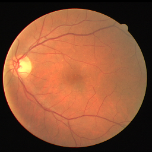
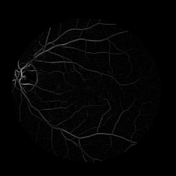
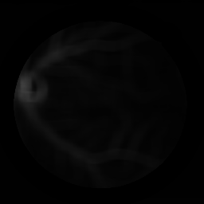
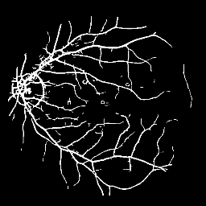
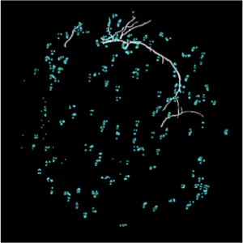

# Eye-Fundus-Image-Segmentation

Python implementation of vasculature segmentation on retina image based on the [Hoover](http://www.uhu.es/retinopathy/General/000301IEEETransMedImag.pdf)'s and [Zhang](http://azadproject.ir/wp-content/uploads/2014/12/2009-Retinal-Vessel-Extraction-by-Matched-Filter-with-First-Order-Derivative-of-Gaussian.pdf)'s works. 

## Approach: Matched Filter with First-Order Derivative of Gaussian (FDoG) and Genetic Algorithm (GA) Optimization
This approach is based on [Zhang](http://azadproject.ir/wp-content/uploads/2014/12/2009-Retinal-Vessel-Extraction-by-Matched-Filter-with-First-Order-Derivative-of-Gaussian.pdf)'s work.

### Usage
```Python
python mfr.py RETINAL_IMAGE MASK_IMAGE
```
Note: the mask image represents the outside area. 

Optional: To obtain a better set of hyper-parameters, I also provide the code of genetic algorithm for parameter optimization. 
```
python ga.py RETINAL_IMAGE GROUND_TRUTH_IMAGE
```

### Results
Original image.  

. 

Result of Gaussian Matched Filter. 

. 

Result of First Order Derivative of Gaussian. 

. 

Final segmentation.  

.  

## Approach: Piecewise Threshold Probing of the Matched Filter Response
This approach is based on [Hoover](http://www.uhu.es/retinopathy/General/000301IEEETransMedImag.pdf)'s work. 

### Usage
```Python
python thprobing.py RESULT_OF_GAUSSIAN_MATCHED_FILTER
```
Note: to implement this algorithm, you need to obtain the Gaussian matched filter result from first algorithm (the second output from mfr.py).

### Results
Generate vessels from each probes (the blue dots).  



## Dataset
I suggest [DRIVE](https://www.isi.uu.nl/Research/Databases/DRIVE/) database, since it provides the retina image, ground truth and mask images. 